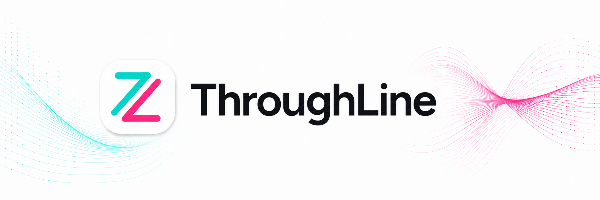
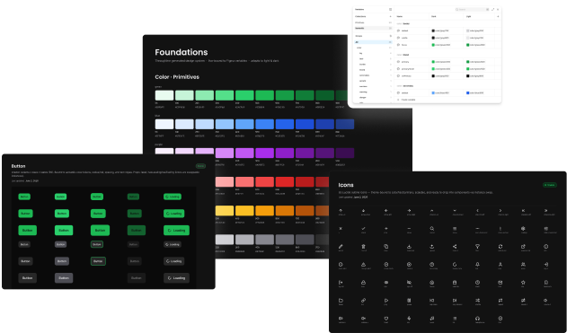

<div align="center">



# ThroughLine

### Your agentic design team

**A Claude Code plugin packed with every skill you need to launch and manage a production-grade design system in hours — not months.**

[](.claude-plugin/plugin.json)
[](LICENSE)
[](https://docs.claude.com/en/docs/claude-code)
[](https://main--6a1ee089ae3a37b70a6e4559.chromatic.com)
[](https://www.figma.com/design/OCiZiGpsJ4ncPD8r205BjC/Throughline-Plugin-Test?node-id=0-1&t=5ERihD6fMqMuTEXD-1)

</div>

Whether you're starting from scratch or retrofitting an existing design system, ThroughLine puts you in the driver's seat — you make the high-level decisions while your agentic team powers through the production work. You stay in control of the *what*; it handles the *how*.

**No code experience required.**

---

## What ThroughLine builds

### In Figma

1. **A robust primitive + semantic token system** — color ramps, spacing, type scale, radius, and elevation, with light/dark and multi-brand modes.
2. **Automatic generation of all text and effect styles** — every type and shadow style, derived from your tokens.
3. **A visual style sheet** of every token and style for full team transparency — synced to your tokens on demand.
4. **A full icon component system** — Lucide, Material, or your own SVGs, imported as clean, scalable components.
5. **A foundational component library** — buttons, inputs, badges, cards, and more, built as proper variant matrices bound to your tokens.

### In code

1. **A pnpm + Turborepo monorepo** on GitHub, scaffolded for you.
2. **A sync adapter** that syncs your Figma tokens and components to the code framework of your choice.
3. **Storybook** configured to house all synced components and their documentation.
4. **CI via Chromatic** for visual regression testing on every push.

### Daily workflow

1. **`/sync-figma-tokens`** — resync changes from Figma to code, landed as a reviewable PR.
2. **`/new-component`** — ship a new component in Figma, then sync and publish it to code.

## See a real end-to-end system built with it



| | |
|---|---|
| 🧩 **[Sample repo](https://github.com/jrpease/throughline-sample)** | The full monorepo — tokens, 14 components, Storybook, CI |
| 📚 **[Live Storybook](https://main--6a1ee089ae3a37b70a6e4559.chromatic.com)** | Every component, all props, auto-generated docs |
| 🎨 **[Public Figma file](https://www.figma.com/design/OCiZiGpsJ4ncPD8r205BjC/Throughline-Plugin-Test?node-id=0-1&t=5ERihD6fMqMuTEXD-1)** | The design source of truth it was generated from |

Everything above was created during a single working session and synced directly from Figma to a production-ready codebase.

## Getting started

### Requirements

| | |
|---|---|
| **[Claude Code](https://docs.claude.com/en/docs/claude-code)** | Required — ThroughLine is a Claude Code plugin. |
| **Figma** | Required, **desktop app** (the browser version causes connection errors). **Professional plan or higher recommended** — multi-mode variables (Light/Dark, brand themes) need it. |
| **Figma access token** | Required — read/write your file. The setup skill walks you through it; your token stays yours and is never shared in chat. |
| **GitHub** (or similar) | Optional — only when you're ready to graduate to a real remote repo with PRs and CI. |

### Install

Install from this repo's plugin marketplace:

```
/plugin marketplace add jrpease/throughline
/plugin install throughline@throughline-marketplace
```

Then start with:

```
/throughline:start
```

This is the reliable entry point — it runs environment setup first, ahead of anything else. (You can also just say *"let's set up my design system"*, but if you have other plugins installed that grab "let's build…" style phrases, the slash command guarantees ThroughLine takes the wheel.)

From there, Claude walks you through executing its **9 skills powered by 7 reference documents**, sequenced based on your unique needs and goals. The plugin is built to provide consistent checkpoints for human review and guidance — letting you make the big decisions while it does the dirty work.

Update anytime with:

```
/plugin marketplace update throughline-marketplace
```

## Architecture

ThroughLine is more than a pile of skills — it's a small system designed to stay consistent across dozens of generation steps. Four layers work together:

**🛠 Nine skills — the steps.** Each owns one stage of the journey, from connecting Figma to standing up CI. They're sequenced, and each knows its prerequisites.

**📐 Seven reference docs — the constitution.** Shared standards every skill obeys: Figma component rules (auto-layout-on-everything, slot contracts, naming-as-contract, a required post-build audit), the brainstorm-before-build protocol, the sync-adapter specs, the manifest schema, coding-level adaptivity, and the publishing flow. This is *why* two different runs produce the same structure — the rules live in one place, not scattered per skill.

**🧭 An orchestration layer — the memory.** A `design-system.json` manifest in your project records exactly what's set up, with a versioned schema and immutability rules. Every skill reads it, tells you what it's about to do, and offers to run anything missing first. Run **`/design-system-status`** anytime for a plain-language picture of where you stand.

**🔌 An adapter layer — the bridge.** A Style Dictionary pipeline that translates your Figma variables into whatever code framework you target — and re-translates on every change, so design and code never drift.

### The skills

| Skill | What it does |
|---|---|
| **figma-environment-setup** | Create your working folder, connect Claude to Figma, scan what already exists. **Start here.** |
| **token-builder** | A two-tier (primitive + semantic) token system as Figma variables, plus text/effect styles. Generative, descriptive, or import-your-own. |
| **token-sheet-builder** | A beautiful, on-brand **Foundations** page visualizing every token, live-bound to the variables. |
| **icon-system-builder** | An **Icons** page with your chosen library (Lucide, Material, or custom) as clean components — the cheap, fast way. |
| **component-builder** | Your foundational components (button, input, card, modal…) with full variant matrices, slots, and token bindings. |
| **repository-builder** | Graduate your folder into a pnpm + Turborepo monorepo — folder → local git → GitHub, one gentle step at a time. |
| **token-sync-layer** | Sync Figma variables to framework-specific code via Style Dictionary, landed as a reviewable PR. Installs `/sync-figma-tokens`. |
| **storybook-chromatic-builder** | Storybook, component stories, Chromatic visual testing, and Code Connect (where your Figma plan supports it). |
| **component-pipeline** | Add one new component end to end: Figma → tokens → code + stories. Installs `/new-component`. |

## The nitty gritty

For the technically curious — how the machine actually runs.

**The sync layer.** Figma variables are extracted to **DTCG-format** JSON (the W3C design-tokens standard), run through **Style Dictionary**, and shaped by a framework **adapter** into the exact output your stack expects — shadcn CSS variables, a Tailwind theme, MUI theme objects, Swift/Kotlin constants, or plain CSS. Because the code is *generated* from the extract, design and code can't drift: you never hand-edit outputs, you change Figma and re-run. The sync lands as a **pull request**, so every design change is reviewable, diffable, and CI-checked before it merges.

**The monorepo.** A **pnpm + Turborepo** workspace: `packages/` holds the generated tokens and the component library; `apps/` is where you build the actual product against your own design system. ThroughLine grows it in stages — plain folder → local git → GitHub remote with PRs and CI — introducing each concept only when its payoff is concrete, so you're never dropped into the deep end.

**The manifest.** `design-system.json` is the single source of truth for *state*: a versioned schema, canonical per-skill flags, an immutable record of how your project began (greenfield vs. existing repo), and a snapshot of tooling detected at setup. Skills read it to know what's done and what's safe to do next — which is how the system stays coherent across many sessions.

**Modes, within Figma's limits.** Light/Dark lives on the semantic collections; brand variants live on the primitive palette. Splitting the two axes across two collections keeps each one under Figma's 4-modes-per-collection cap on the Professional plan while still resolving correctly (`bg/default` → `{gray/50}` → the active brand's gray).

**Model routing.** Setup runs on **Haiku** automatically to keep first-run costs low. Everyday work runs on whatever model your session is set to — **Sonnet** is a sensible default. For the heaviest authoring (large token systems, intricate variant matrices), **Opus** gives the best results: `/model opus`, then back to `/model sonnet`. Nothing forces an expensive model on you.

## Who it's for

1. **Solo designers** who spend a lot of time building and managing design systems.
2. **Agencies** consistently spinning up new design systems for clients.
3. **Design teams** constantly fighting to keep their Figma and code systems in sync.
4. **Non-designer vibe coders** who want a stronger design-system backbone on their projects.
5. **Engineers** looking to bridge their code and design ecosystems.

## Why I built it

I'm a designer who got tired of the handoff. Design systems live in two places that never quite agree — the Figma file and the codebase — and keeping them in sync is a full-time job nobody wants. ThroughLine is the tool I wished existed: it lets a designer drive the whole pipeline, learn the engineering one concept at a time, and end up with a real, shippable system instead of a pile of redlines. If you're a designer who's becoming a developer, this was built for you.

## Works well with

**[Superpowers](https://github.com/obra/superpowers)** — a great planning and engineering partner for the moments that grow bigger than a single skill. ThroughLine owns the design-system line; Superpowers owns the heavier, open-ended engineering work — and the two hand off cleanly.

- **Big, ambiguous changes mid-build.** When a step turns into a real project, ThroughLine lays out the risks and major pieces and switches into brainstorm-and-plan mode before building — handing off to Superpowers when it's installed, or planning natively when it isn't (the recognition is ThroughLine's; Superpowers is an upgrade, not a requirement). Real example: on [radicool.studio](https://radicool.studio), an existing vanilla-React app with a full custom motion layer — custom cursors, magnetic buttons — was retrofitted onto shadcn to make it formal and ready to scale.
- **Building the app itself.** Once your system is synced to code and you're building in `apps/`, Superpowers' subagent-driven development methodology is a natural next step.

It's never required to use ThroughLine.

## Show it off

Built your own system with ThroughLine? Add the badge so others can find it:

```markdown
[](https://github.com/jrpease/throughline)
```

[](https://github.com/jrpease/throughline)

## Contributing

ThroughLine is open source and contributions are welcome. Found a bug or have an idea? **[Open an issue](https://github.com/jrpease/throughline/issues)**. Want to improve a skill or reference doc? PRs are encouraged — the skills are Markdown, so they're approachable to edit.

A couple of ground rules:
- **Figma is the source of truth.** Generated code files are build artifacts — never hand-edited; change things in Figma and re-sync.
- **Secrets stay yours.** Tokens and keys are never sent through chat or committed to code.

## Roadmap

Future improvements and planned capabilities. Have a request? **[Open an issue](https://github.com/jrpease/throughline/issues)** — the roadmap is shaped by what people actually build.

- **More framework adapters** — broaden the Style Dictionary output targets beyond the current set.
- **Deeper Code Connect coverage** — richer Figma-to-code mappings as more plans support it.
- **Expanded component starters** — a larger foundational kit out of the box.
- **Richer status & auditing** — more from `/design-system-status`, including drift detection between Figma and code.
- **Built-in accessibility checks** — automatic a11y validation when tokens and components are created, so modes can't be built with poor color contrast and components can't ship with accessibility gaps. Catches issues at creation time rather than in review.
- **One library, many platforms** — support a single Figma token library that syncs to multiple platforms at once (React, Android, iOS), with a component lifecycle flexible enough to target per platform — every platform, or native-only components that don't need a React counterpart.

Versioning follows [Semantic Versioning](https://semver.org). The current version lives in [`.claude-plugin/plugin.json`](.claude-plugin/plugin.json); every release is recorded in [`CHANGELOG.md`](CHANGELOG.md).

## License

[MIT](LICENSE) © Jordan Pease
